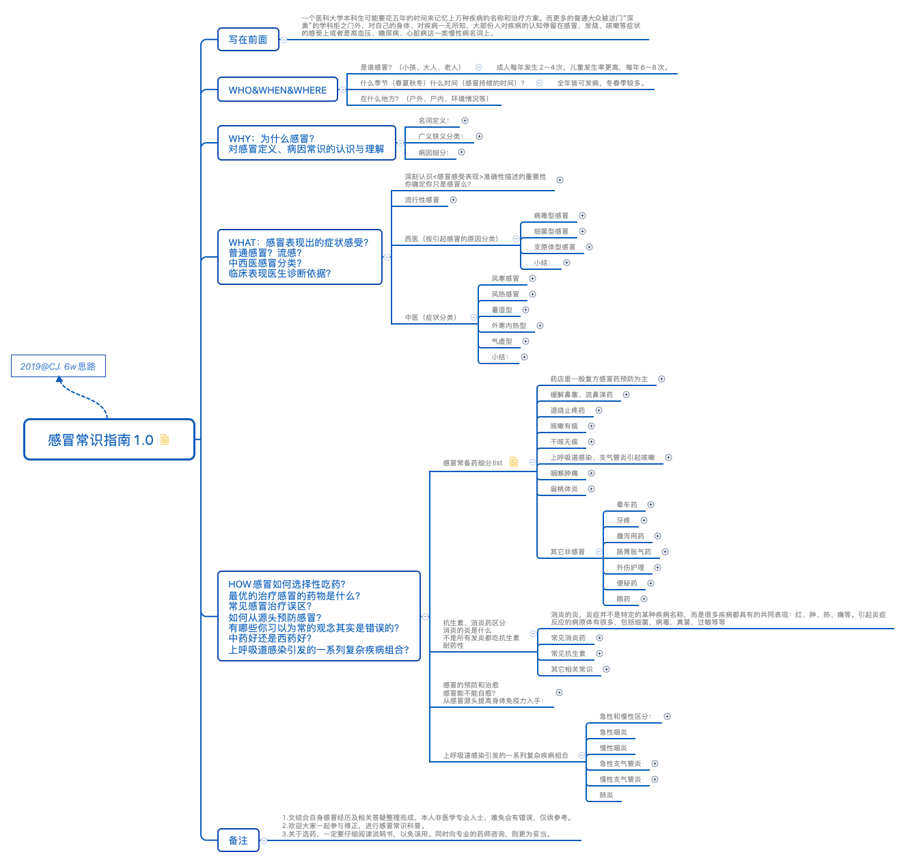

* content
{:toc}

> ''一个医科大学本科生可能要花五年的时间来记忆上万种疾病的名称和治疗方案。而更多的普通大众被这门“深奥”的学科拒之门外，对自己的身体、对疾病一无所知，大部份人对疾病的认知停留在感冒、发烧、咳嗽等症状的感受上或者是高血压、糖尿病、心脏病这一类慢性病名词上。这种认知水平就像盲人摸象一样，根本无法认清疾病的真相。“疾病”被保留在一种神秘的、复杂的、和难以理解的状态，病人则被搞得晕头转向，以为只有那些受过正式教育的专家才可能对付，因而将健康的主导权拱手交给医生，成了一群处于弱势的医疗产品消费者。''由此看，具备一定医学常识尤为重要，那么就从日常最常见的感冒入手进行知识储备吧。

诺贝尔文学奖获得者吉卜林说：“我有六个诚实的仆人，他们教给了我一切。他们的名字是：什么（What）和为什么(Why)、何时(When)和怎样(How)、何地(Where)和谁(Who)”。借用这六个诚实的仆人对''感冒问题''梳理如下：

## Who/when/where

1. 是谁感冒？（小孩、大人、老人、有无病史）
2. 什么季节?（春夏秋冬）什么时间?（感冒持续的时间）
3. 在什么地方？（户外、户内、环境情况等）

## Why

人为什么会感冒？对感冒定义、病因常识的认识与了解。

> 比如：急性上呼吸道感染简称上感，又称感冒，是包括鼻腔、鼻窦咽或喉部急性炎症的总称。
>
> 
>
> @截图：《内科学》第八版

## What

感冒表现出的症状感受？普通感冒？流感？中西医感冒分类？临床表现医生诊断依据？你确定你只是感冒么？

> 比如：西医和中医对感冒有不同的分类，中医按症状分类：风寒型、风热型、暑湿型、外寒内热型、气虚型；西医按引起感冒的原因分类，病毒型、细菌型、支原体型。这些分类概念都需要有一定认识，结合自身的症状表现进行分析帮助找到引起感冒发生的根本原因，而不是盲目的吃药。

深刻认识<感冒感受表现>准确性描述的重要性，因为你的表述会直接影响药房卖药的是否能开治根的正确的药，医院医生是否能做出正确的诊断。真正做到提前预防、发生后及时对症下药、防范症状恶变。

## HOW

感冒如何针对性吃药治疗？最优的治疗感冒的药物是什么？避免哪些误区？如何从源头预防感冒？感冒常备药细分list？抗生素、消炎药区分？消炎的炎是什么？不是所有发炎都吃抗生素？耐药性？...

比如关于感冒整理的一些常见误区：

>1. 捂热出一身汗能够治愈感冒真的要靠运气。
>2. 风寒风热感冒区别对待，风热感冒不能喝姜汤，风寒感冒不能吃寒性食物如冰糖雪梨，风寒引起咳嗽不能吃川贝枇杷膏，吃错会加重病情。分清楚预防感冒和已经感冒，多喝热水、吃VC是预防感冒，感冒发生了这样的操作无效。
>3. 流清鼻涕还是黄鼻涕不是判别感冒类型的唯一标准。感冒引起咳嗽首先要治疗感冒，在治疗咳嗽。咳嗽要区分有痰和干咳。咽喉发炎要区分是痒还是肿痛。
>4. 如果你是由病毒、真菌等因素引起的炎症，吃抗生素是无效，只有细菌感染才能找抗生素。普通感冒本身是有自愈性的，但如果不好好休息配合，那继发之后的细菌性感染（传变），治疗起来过程会变长。

**在思考如何治疗感冒的时候，有全局观的人还是少，何谓之全局观？从来不会孤立的静止的看待问题，而是把问题放在一个系统里来看待。**同样是感冒，有的可能是发炎有的可能是风寒引起的，确诊之后对症下药，不然你会觉得吃什么感冒药都不怎么管用。

总结：很多病就是错误的治疗方式，错误的营养学，错误的作息规律导致的。提到作息，**讲真你有多少个年没有23点之前入睡了呢？**希望大家跟我有一样熬夜晚睡的习惯的朋友，都能利用人性中恐惧的因素，让自己建立新的良好的习惯。

